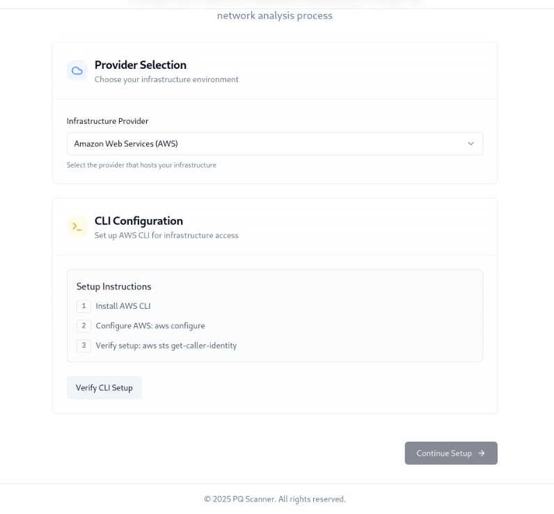
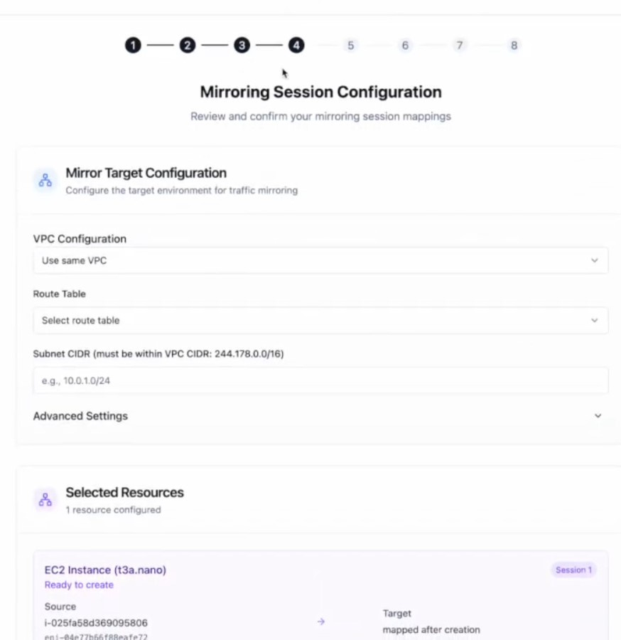
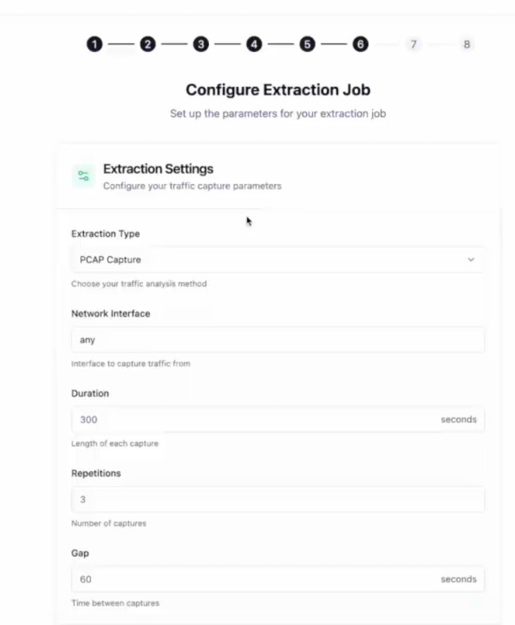
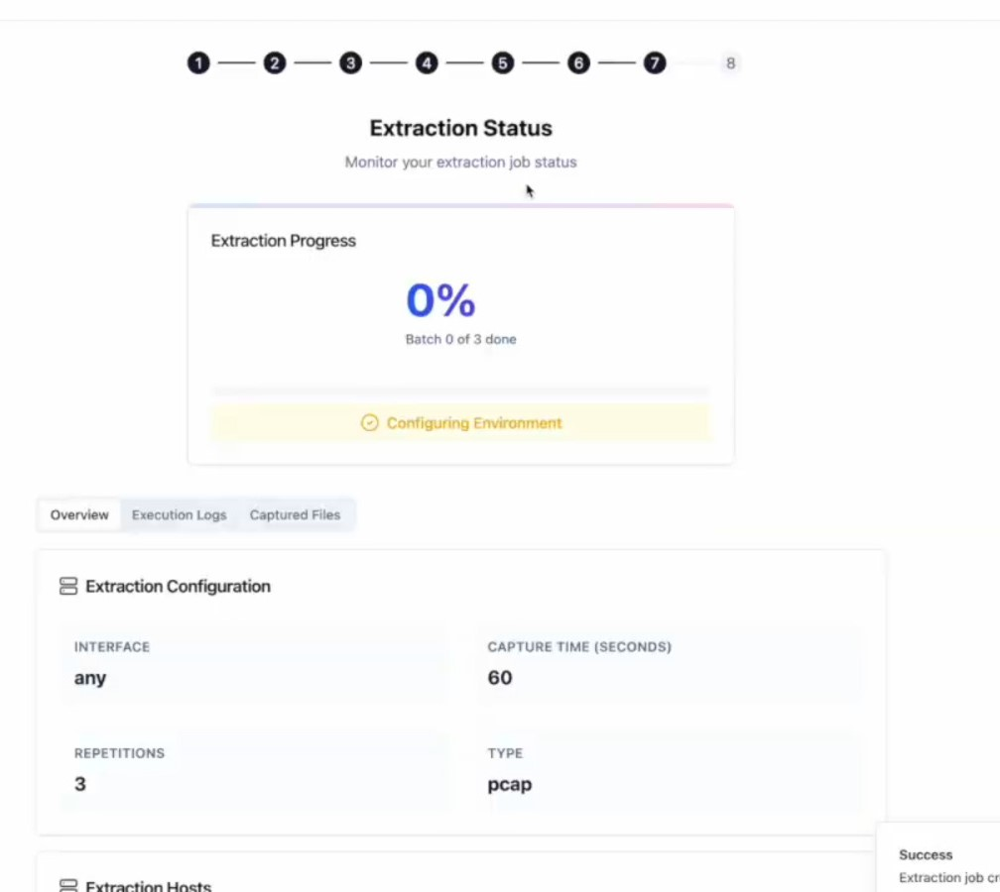

.. Qvision_Docs documentation master file, created by
   sphinx-quickstart on Sun Mar  2 09:52:55 2025.
   You can adapt this file completely to your liking, but it should at least
   contain the root `toctree` directive.

Qvision Documentation
=====================

.. Add your content using ``reStructuredText`` syntax. See the
.. `reStructuredText <https://www.sphinx-doc.org/en/master/usage/restructuredtext/index.html>`_
.. documentation for details.

Qvision is a powerful tool that enables network analysis and infrastructure monitoring. It allows you to **scan, analyze, and extract network data** in a structured manner. Whether you're using AWS or an on-premises environment, Qvision offers a seamless way to manage network mirroring sessions and extract valuable insights.

Click the **"Get Started"** button to begin.

**Infrastructure Setup**
========================

Before you start using Qvision, you need to configure the infrastructure based on your deployment model. Qvision supports two primary environments:

AWS
----

Qvision provides **automated infrastructure detection** for AWS users. With the **"Network Scan"** feature, the system can scan and **identify existing infrastructure**, making it easy to set up mirroring sessions.

Key capabilities of AWS integration:
  
- **Automatic infrastructure detection** through network scanning.  
- **Seamless mirroring session creation** for analyzing network traffic.  

This automated approach **reduces manual effort** and ensures **efficient setup** of the Qvision environment.

On-Prem
--------

For on-premises deployments, users must manually configure the infrastructure. Unlike AWS, where automatic scanning is available, the **on-prem setup requires manual intervention** to ensure correct data extraction.

Manual setup includes:

- **Configuring network taps** to monitor traffic.  
- **Manually specifying infrastructure details** for accurate data extraction.  

After selecting the appropriate setup, click **"Verify CLI"** to ensure the configuration is correct. 

If necessary, update the credentials by clicking **"Reset Credentials"**, then enter:

- AWS access key ID  
- Secret access key  
- Region  

Once the credentials are updated, click **"Continue Setup."**

Choosing Scan Option
--------------------

After setting up the infrastructure, the next step is to choose the **scanning method**. Qvision offers two options:

Network Scan
~~~~~~~~~~~~

The **Network Scan** feature automatically detects available infrastructure and sets up mirroring sessions for traffic monitoring. It reads AWS credentials and **retrieves a list of detected instances**, enabling a **hassle-free configuration process**.

Manual Entry
~~~~~~~~~~~~

For users who prefer manual control, Qvision allows **manual entry of infrastructure details**. This option is useful in on-prem environments where automated detection is **not possible**.

**Network Analysis**
====================

Qvision provides an intuitive **hierarchical network analysis** tool that helps users visualize their infrastructure. At the highest level, the **Virtual Private Cloud (VPC)** acts as the primary container for networking resources. 

The **network hierarchy** consists of:

- **VPC (Virtual Private Cloud)** at the top level.  
- **Subnets** within the VPC, organizing the infrastructure.  
- **Mirroring support for Application Load Balancers (ALBs)** and specific EC2 instances.  

> **Note:** Network Load Balancers (NLBs) **are not supported** for mirroring.

Unsupported EC2 instances will be **marked with a red exclamation symbol** in the interface.

The **"Network Visualization"** tab provides an **interactive network map**, giving users a **clear representation of the infrastructure**. 

Click **"Continue Mirroring"** to proceed to the **Mirroring Session Configuration** section.

**Note:** If you want to connect to the EC2 via SSH, copy the IP address and use it. For the
attached picture, the IP is 13.213.66.100. 

**Mirroring Session Configuration**
===================================

In this step, you will configure the mirroring targets and connectivity settings. The mirroring session is essential for **capturing and analyzing network traffic**.

Qvision allows mirroring within:

- **The same VPC but different subnets**.  
- **Future releases will support cross-VPC mirroring**.  

To ensure proper routing, you need to:

- **Choose a routing table**, selecting either **Local Routing** or an **Internet Gateway**.  
- **Specify the CIDR range** for the new subnet to define the network scope. For example, the 244.178.0.0/16 subnet gives you a range of IP addresses from 244.178.0.0 to 244.178.255.255. The first address (244.178.0.0) is reserved as the network ID, and the last one (244.178.255.255) is used for broadcasting messages to all devices in the network. This means you can use any IP from 244.178.0.1 to 244.178.255.254 for computers, servers, or other devices. 

For **advanced users**, Qvision provides customization options:

- Select specific **EC2 instance types** to optimize performance.  
- Choose **Amazon Machine Images (AMIs)** for the mirrored instances.  

Once all configurations are finalized, click **"Confirm Configuration"**. Qvision will use **Terraform and Ansible** to deploy the mirroring session. The log section will display **real-time updates** on the setup process.
You can also view the system logs by clicking the tab. 

**Process Information**
======================

Once the mirroring session is configured, Qvision provides a **visual representation** of the mirroring system. This visualization includes:

- **VPC details**  
- **Subnet structures**  
- **EC2 instances connected to the session**  

After verifying the setup, click **"Start Extraction"** to proceed.

**Extraction Settings**
=======================

The extraction process in Qvision is responsible for **capturing network traffic**. In this phase, you need to configure:

- **Extraction Type:** Choose **"PCAP Capture"** for packet-based network traffic analysis.  
- **Network Interface:** Specify the network interface (use `"any"` if unsure).  

Additional settings include:

- **Capture duration** to define how long the extraction should run.  
- **Repetition settings** to configure recurring extractions.  

Click **"Start Extraction"** to initiate the extraction process.

**Extraction Status**
=====================

During extraction, Qvision performs several steps to ensure proper data collection. The process involves:

- **Configuring the environment** by setting up necessary services.  
- **Installing dependencies** required for traffic monitoring.  
- **Starting the extraction process** and capturing packets. 

The progress bar will indicate the **status of the extraction**. Once the extraction reaches **100% completion**, users can download the **PCAP files** for further analysis.

.. toctree::
   :maxdepth: 2
   :caption: Contents:
